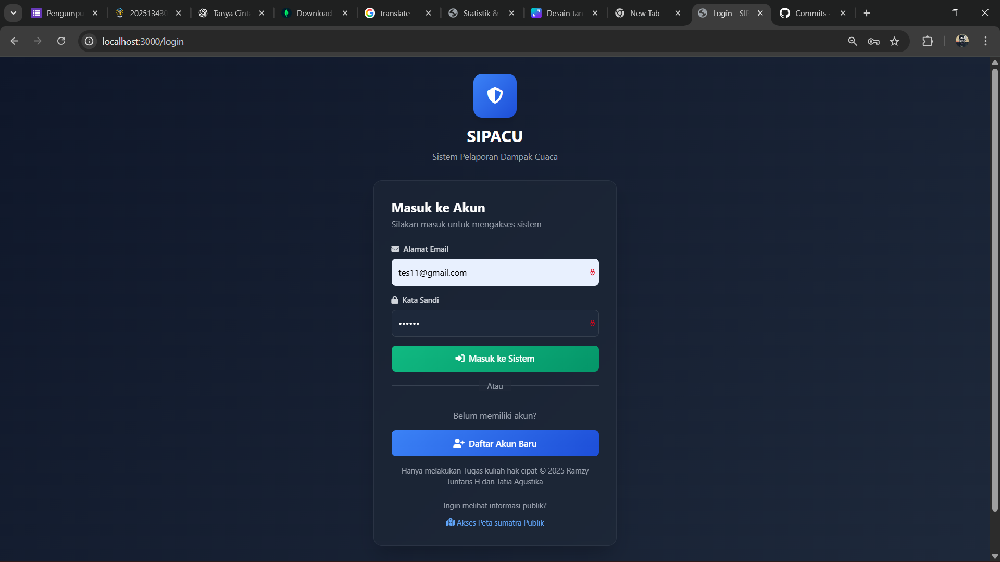
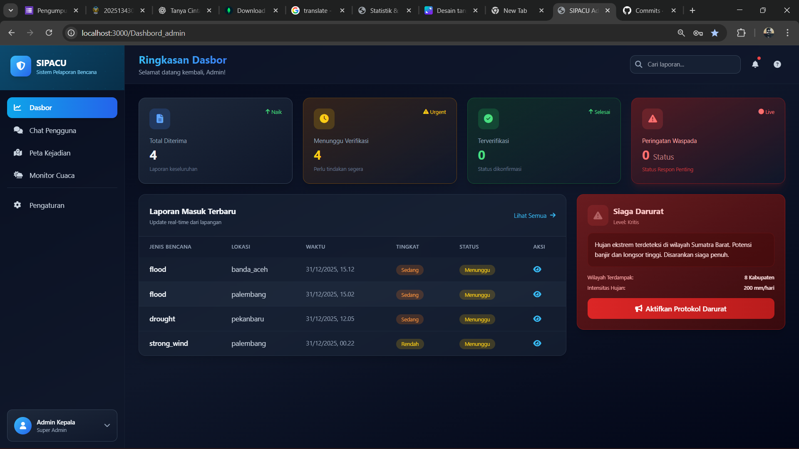
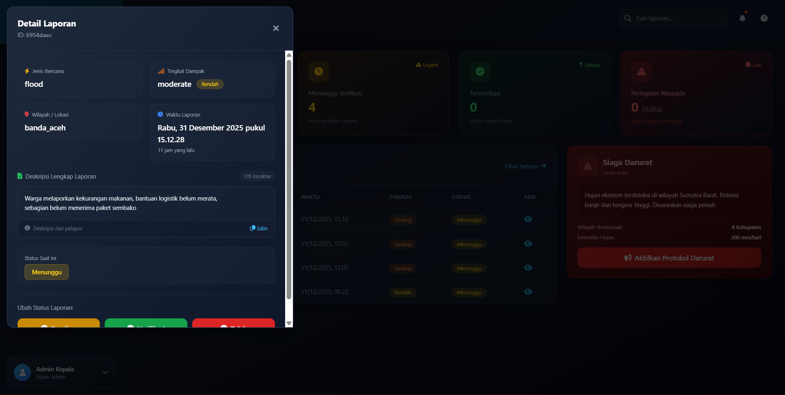
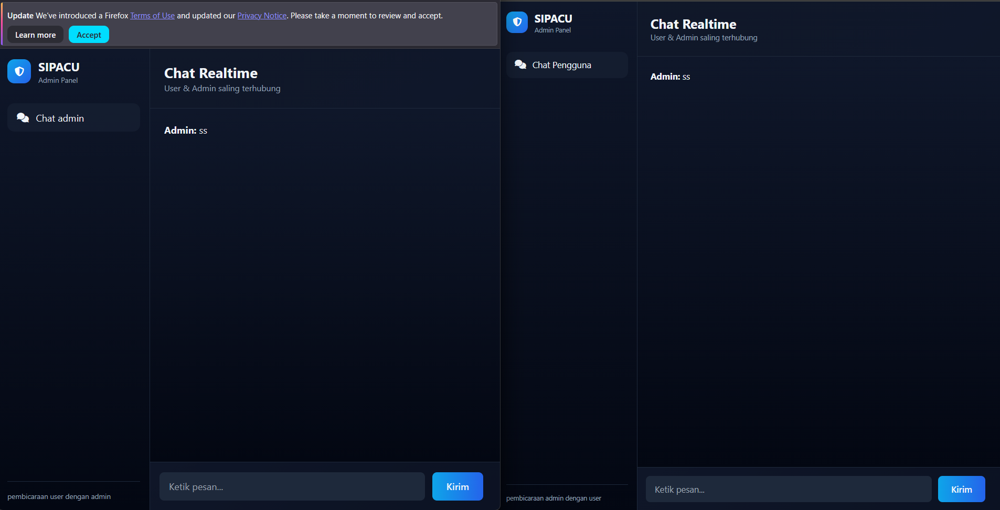
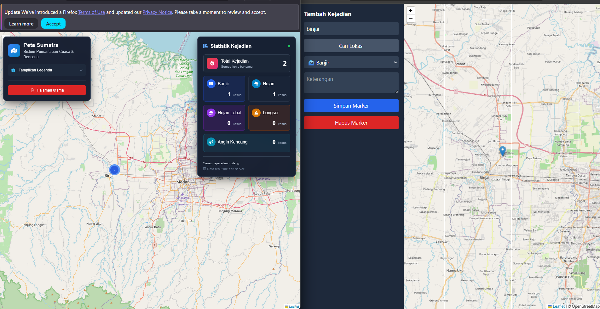
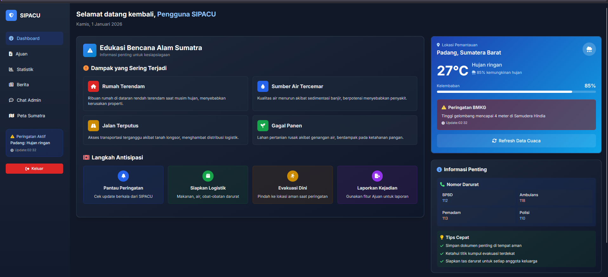
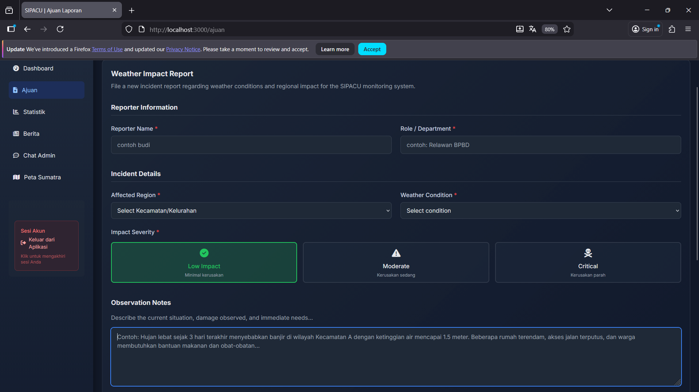
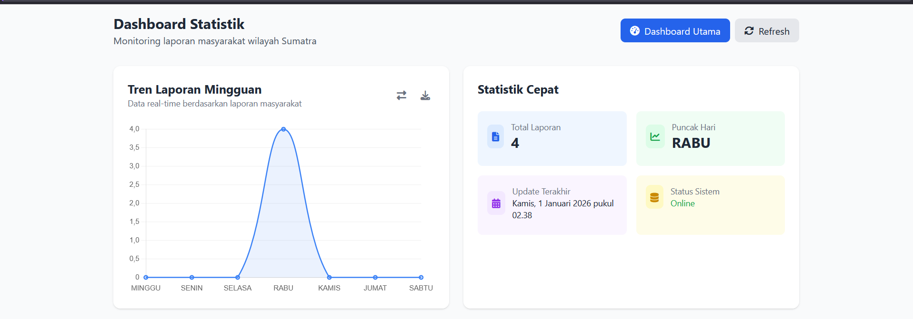
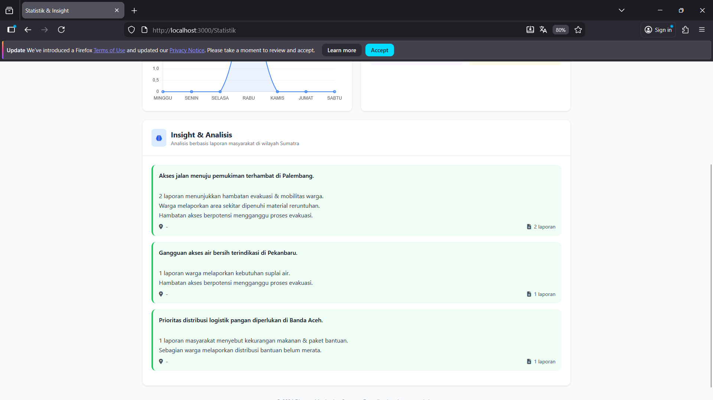
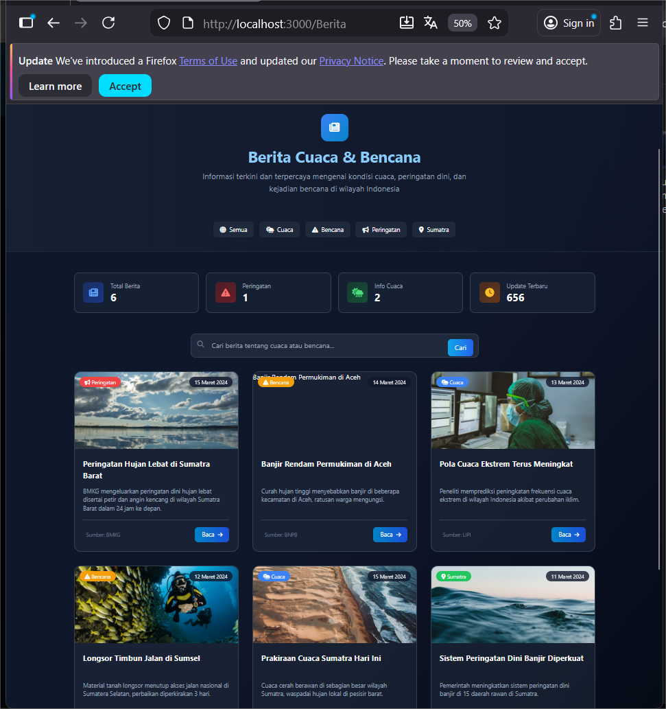

# SIPACU - Sistem Pelaporan Dampak Cuaca & Kondisi Wilayah

<div align="center">


**Sistem Pelaporan Berbasis Web untuk Monitoring Dampak Cuaca dan Kondisi Wilayah**

</div>

## 🎯 Tentang Proyek

**SIPACU** (Sistem Pelaporan Dampak Cuaca & Kondisi Wilayah) adalah aplikasi berbasis web yang dirancang untuk memfasilitasi masyarakat dalam melaporkan dampak cuaca dan kondisi wilayah secara terstruktur. Sistem ini juga menyediakan informasi kesiapsiagaan bencana yang dapat diakses oleh seluruh pengguna.

Proyek ini dikembangkan sebagai bagian dari praktikum **Pemrograman Jaringan** dengan fokus pada:
- 🔄 Integrasi sistem pelaporan real-time
- 📊 Pengelolaan dan analisis data berbasis web
- 🎨 User interface yang responsif dan mudah digunakan

> **Catatan Penting:** Modul statistik menggunakan perhitungan manual berbasis data laporan, **tanpa menggunakan AI**, untuk menghasilkan analisis yang terukur dan relevan dengan kebutuhan praktikum.

---

## 🎯 Tujuan Sistem

| No | Tujuan | Deskripsi |
|:--:|--------|-----------|
| 1 | **Kemudahan Pelaporan** | Mempermudah masyarakat melaporkan kejadian terkait dampak cuaca dengan interface yang user-friendly |
| 2 | **Edukasi & Informasi** | Menyediakan informasi edukasi dan peringatan dini terkait bencana alam dan cuaca ekstrem |
| 3 | **Validasi Data** | Mendukung proses validasi dan verifikasi laporan oleh admin untuk memastikan akurasi informasi |
| 4 | **Monitoring Wilayah** | Menyajikan statistik dan rekap pelaporan sebagai bahan monitoring kondisi wilayah secara berkala |

---

## ✨ Fitur Utama SIPACU

Halaman utama SIPACU berfungsi sebagai portal pengenalan sistem sekaligus
gerbang masuk menuju dashboard pelaporan dan pemantauan bencana.

Tampilan dirancang dengan pendekatan modern, responsif, dan informatif sehingga
pengguna langsung memahami tujuan sistem serta alur penggunaan sebelum masuk ke dashboard.

---

### 🌍 Halaman Beranda (Landing Page Utama)

<table>
<tr>
<td width="50%">

#### 🖥️ Tampilan Halaman Utama

Halaman ini berfungsi sebagai pengantar sistem dengan menampilkan:

**Informasi yang ditampilkan:**
- Nama sistem & deskripsi fungsi utama
- Penjelasan singkat tujuan platform
- Tombol akses menuju dashboard
- Struktur layout responsif & user–friendly

**Peran halaman:**
- Memberikan gambaran sistem secara ringkas
- Menjadi halaman pembuka sebelum user masuk aplikasi
- Menjadi identitas dan branding sistem SIPACU

</td>
<td width="50%">

<div align="center">

.png)
*Halaman beranda SIPACU — halaman portal sebelum masuk dashboard*

</div>

</td>
</tr>

<tr>
<td width="50%">

#### ⚙️ Seksi "Fitur Utama SIPACU"

Bagian ini menjelaskan inti kemampuan sistem secara ringkas agar mudah dipahami pengguna sebelum menggunakan aplikasi.

**Fitur yang diperkenalkan:**
- Pemantauan Real-time kondisi cuaca & wilayah
- Pelaporan cepat berbasis form digital
- Analisis data berbasis laporan masyarakat

**Tujuan section ini:**
- Memberikan edukasi fungsi sistem
- Mengarahkan pengguna ke fitur inti
- Menjadi informasi ringkas non-teknis

</td>
<td width="50%">

<div align="center">

.png)

*Bagian penjelasan fitur utama SIPACU*

</div>

</td>
</tr>

<tr>
<td width="50%">

#### 🔎 Seksi "Bagaimana SIPACU Bekerja?"

Bagian ini menjelaskan alur penggunaan sistem secara bertahap.

**Alur sistem yang ditampilkan:**
1️⃣ Pantau kondisi cuaca & status wilayah  
2️⃣ Laporkan kejadian melalui form pelaporan  
3️⃣ Data dikumpulkan untuk analisis & evaluasi

**Manfaat untuk pengguna:**
- Memudahkan pemahaman alur sistem
- Mengarahkan pengguna ke proses yang benar
- Memberikan gambaran workflow aplikasi

</td>
<td width="50%">

<div align="center">

.png)

*Visualisasi alur kerja sistem SIPACU*

</div>

</td>
</tr>
</table>

---

## ⚙️ Fitur Admin SIPACU

Modul Admin digunakan untuk mengelola laporan bencana, memantau aktivitas sistem,
melakukan verifikasi data, serta berkomunikasi langsung dengan pengguna.

Seluruh fitur pada panel admin dirancang agar membantu proses pengambilan keputusan
berbasis data lapangan secara lebih cepat dan terstruktur.

---

### 🔐 Login Administrator

Halaman login berfungsi sebagai gerbang autentikasi akun admin sebelum dapat
mengakses sistem manajemen laporan.

**Fitur halaman login:**
- Validasi input email & password
- Autentikasi berbasis token (JWT)
- Pembatasan akses berdasarkan role akun
- Redirect otomatis setelah login sukses

<div align="center">



*Halaman autentikasi Admin*

</div>

---

### 🎛️ Dashboard Administrator

Dashboard utama menampilkan ringkasan data laporan dan kondisi sistem
dalam bentuk kartu informasi dan tabel laporan terbaru.

**Informasi yang ditampilkan:**
- Total laporan diterima
- Jumlah laporan menunggu verifikasi
- Jumlah laporan terverifikasi
- Status peringatan kondisi wilayah (siaga darurat)
- Daftar laporan terbaru dari pengguna

**Tujuan dashboard:**
- Memberikan gambaran kondisi sistem secara cepat
- Membantu admin menentukan prioritas penanganan

<div align="center">



*Ringkasan status laporan & kondisi sistem*

</div>

---

### 📝 Monitoring & Verifikasi Laporan

Modul ini digunakan admin untuk memantau dan memverifikasi laporan yang masuk.

**Alur verifikasi laporan:**
1. Laporan diterima dari pengguna
2. Admin membaca detail laporan
3. Status laporan diperbarui menjadi:
   - Pending  
   - Sedang Diproses  
   - Diverifikasi
4. Laporan disimpan sebagai arsip sistem

**Kegunaan fitur:**
- Memastikan laporan valid sebelum diproses
- Membantu pengelompokan laporan berdasarkan prioritas

<div align="center">



*Tabel laporan terbaru dengan status verifikasi*

</div>

---

### 💬 Chat Realtime Admin ↔ User

Fitur chat digunakan sebagai sarana komunikasi langsung antara admin
dan pengguna untuk klarifikasi laporan atau tindak lanjut.

**Kemampuan modul chat:**
- Pengiriman pesan real-time dua arah
- Identitas pengirim ditampilkan (Admin / User)
- Riwayat pesan tampil dalam sesi percakapan
- Digunakan sebagai media konfirmasi laporan

**Peran fitur:**
- Mempercepat proses respon laporan
- Mengurangi potensi miskomunikasi

<div align="center">



*Komunikasi dua arah antara Admin dan User*

</div>

---

### 🗺️ Peta Kejadian (Admin Map Panel)

Admin dapat menambahkan dan mengelola marker kejadian pada peta wilayah Sumatra.

**Fitur pada peta kejadian:**
- Input lokasi kejadian berdasarkan nama wilayah
- Pemilihan jenis bencana
- Penyimpanan marker ke database
- Tampilan statistik jumlah kasus per kategori

**Manfaat:**
- Mendukung analisis spasial lokasi terdampak
- Membantu pemetaan wilayah risiko

<div align="center">



*Panel manajemen marker kejadian pada peta*

</div>

---
## ✨ Fitur User

<table>

<tr>
<td width="50%">

#### 🏠 Dashboard Utama Pengguna
Menampilkan ringkasan kondisi kesiapsiagaan wilayah, dampak bencana yang sedang terjadi, serta informasi peringatan dini.

**Konten dashboard:**
- Status dampak wilayah
- Informasi kesiapsiagaan
- Peringatan BMKG aktif
- Kondisi cuaca real-time
- Nomor darurat & tips cepat

</td>
<td width="50%">

<div align="center">



*Ringkasan kondisi wilayah & kesiapsiagaan*

</div>

</td>
</tr>

<tr>
<td width="50%">

#### 📝 Pengajuan Laporan Dampak
Form pelaporan kondisi wilayah dengan format terstruktur dan validasi otomatis.

**Data yang dikumpulkan:**
- Identitas pelapor
- Lokasi kejadian
- Kondisi cuaca
- Tingkat dampak
- Catatan situasi lapangan

</td>
<td width="50%">

<div align="center">



*Form pelaporan dampak cuaca & bencana*

</div>

</td>
</tr>

<tr>
<td width="50%">

#### 📊 Statistik & Insight Regional
Visualisasi laporan dalam bentuk grafik serta insight analisis berbasis data.

**Fitur statistik:**
- Tren laporan mingguan
- Total laporan aktif
- Update waktu real-time
- Status sistem
- Insight analisis wilayah

</td>
<td width="50%">

<div align="center">




*Grafik & insight berbasis laporan masyarakat*

</div>

</td>
</tr>

<tr>
<td width="50%">

#### 📰 Portal Berita Cuaca & Bencana
Pusat informasi terpercaya mengenai cuaca, peringatan dini, dan edukasi kebencanaan.

**Kategori konten:**
- Info cuaca harian
- Peringatan bencana
- Laporan wilayah Sumatra
- Artikel edukasi & awareness
- Sumber resmi pemerintah

</td>
<td width="50%">

<div align="center">



*Berita & edukasi kebencanaan terkurasi*

</div>

</td>
</tr>

<tr>
<td width="50%">

#### 💬 Chat Admin (Realtime)
Fitur komunikasi langsung antara pengguna dan admin
(menggunakan tampilan chat yang sama seperti versi admin).

**Kemampuan sistem:**
- Pesan realtime dua arah
- Riwayat percakapan
- Indikator status pesan
- Respons cepat admin

</td>
<td width="50%">

<div align="center">


*Komunikasi pengguna & admin secara langsung*

</div>

</td>
</tr>

<tr>
<td width="50%">

#### 🗺️ Peta Pemantauan Sumatra
Peta interaktif untuk melihat sebaran kejadian bencana & laporan masyarakat  
untuk yang user sebelah kiri dimana meliputi.

**Fitur peta:**
- Marker lokasi kejadian
- Statistik kasus per wilayah
- Update data realtime
- Informasi kategori bencana
- legenda

</td>
<td width="50%">

<div align="center">


*Peta interaktif pemantauan wilayah Sumatra*

</div>

</td>
</tr>

</table>

---

## 📸 Preview Aplikasi

<div align="center">


## 💻 Tech Stack

<div align="center">

### 🖥️ Frontend


### ⚙️ Backend


### 🗄️ Database


### 🔌 Realtime & Utility


</div>

---

## 👥 Tim Pengembang

<div align="center">

### 💫 Berkenalan dengan Kreator SIPACU

*Dua individu berbakat yang berkolaborasi menciptakan solusi inovatif untuk monitoring dampak cuaca*

</div>

---

<table>
<tr>
<td width="50%" align="center">


### **Ramzy Junfaris H**
#### `< Developer />`

<div align="left">

**🎯 Spesialisasi:**
- 🏗️ Perancangan Arsitektur Sistem
- ⚙️ Pengembangan Backend (Express.js)
- 🗄️ Manajemen & Desain Database (MongoDB)
- 🔌 Integrasi API & Realtime Communication
- 📊 Implementasi Dashboard User & Admin
- 🚀 Deployment & Maintenance Sistem

**💼 Peran:**
```
System Architect | Backend Engineer | Database Designer
```

**🛠️ Tech Stack:**
`JavaScript` • `Node.js` • `Express.js` • `MongoDB` • `Socket.io` • `REST API`

</div>

</td>
<td width="50%" align="center">


### **Tatia Agustika**
#### `{ UI/UX Designer & Visual Concept }`

<div align="left">

**🎯 Spesialisasi:**
- 🎨 Perancangan UI/UX Sistem
- 🖌️ Desain Antarmuka Halaman
- 🌈 Konsistensi Warna & Typography
- ✨ Penyusunan Elemen Visual & Ikon
- 📱 User Experience & Layouting

**💼 Peran:**
```
UI/UX Designer | Visual Designer | Frontend Developer
```

**🛠️ Design Tools:**
`Figma` • `Canva` • `HTML/CSS` • `JavaScript` • `Tailwind CSS`

</div>

</td>
</tr>
</table>

---

<div align="center">

### 🤝 Filosofi Kolaborasi

<table>
<tr>
<td align="center" width="33%">

**⚡ Inovasi**

Menciptakan solusi yang tidak hanya fungsional, tetapi juga memberikan dampak nyata bagi masyarakat

</td>
<td align="center" width="33%">

**🎯 Presisi**

Setiap detail dirancang dengan cermat, dari backend architecture hingga pixel-perfect UI

</td>
<td align="center" width="33%">

**🚀 Eksekusi**

Kombinasi sempurna antara technical expertise dan creative vision

</td>
</tr>
</table>

</div>

---

<div align="center">

## 📝 Lisensi

<div align="center">

Proyek ini dikembangkan untuk keperluan akademik - **Praktikum Pemrograman Jaringan**

📚 Universitas | 🎓 Program Studi Teknik Informatika

</div>


<div align="center">

### ⭐ SIPACU - Sistem Pelaporan Dampak Cuaca & Kondisi Wilayah ⭐

**Made with ❤️ by Tatia & Ramzy Junfaris**


[⬆ Kembali ke atas](#sipacu---sistem-pelaporan-dampak-cuaca--kondisi-wilayah)

</div>
